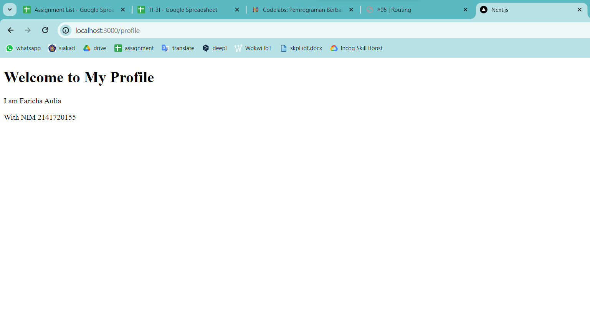
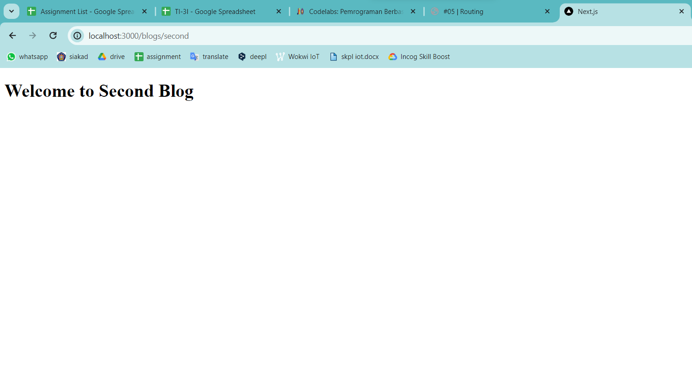
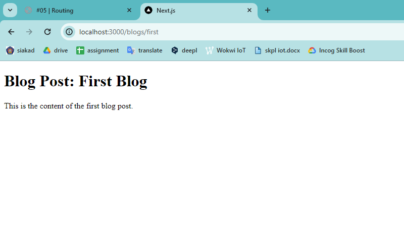
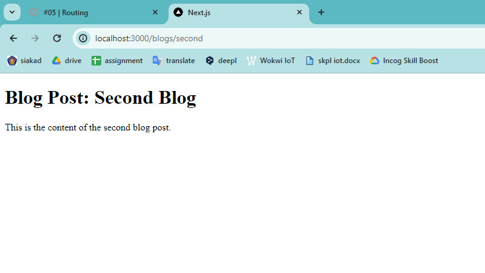
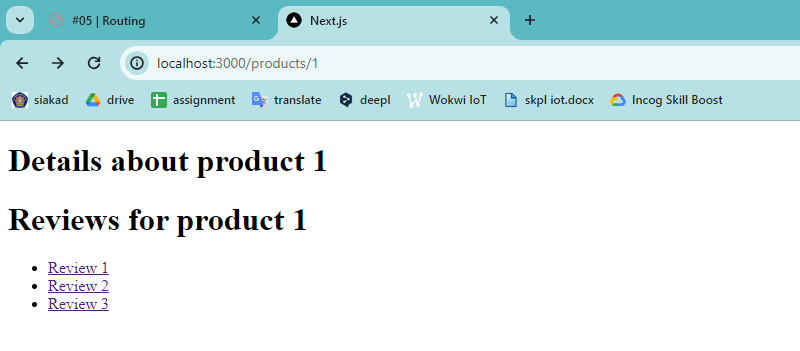
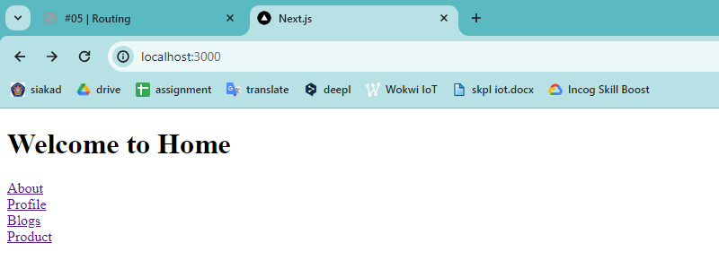

# Laporan Praktikum
| MatKul | Pemrograman Berbasis Framework |
| ---    | ---           |
| Nama   | Faricha Aulia |
| NIM    | 2141720155    |
| Kelas  | TI - 3I       |

<table><tr><td>Saya melampirkan screenshot dari setiap step yang saya lakukan pada src/assets</td></tr></table>

## Praktikum 1
> "Todo: Buatlah halaman /profile yang menampilkan isi biodata anda dengan menggunakan routing di NextJS!"

---

## Praktikum 2
> "Lengkapi function component pada /blogs/second/page.tsx"

**Pertanyaan**
> "Apa kekurangan yang mungkin terjadi jika menggunakan pendekatan pada Praktikum 2 untuk menangani routing?"
1. Struktur folder yang kompleks dan sulit dikelola untuk aplikasi besar.
2. Semua tautan harus dikodekan secara manual dalam komponen.
3. Kurangnya modularitas dan kesulitan dalam membagi kode antar rute.
4. Tidak ada pemisahan kekhawatiran yang jelas antara routing dan rendering.
5. Kurangnya manajemen status rute (pemuatan, kesalahan, rute tidak ditemukan).
6. Tidak ada integrasi dengan pustaka routing populer seperti React Router atau Next.js.

---

## Praktikum 3
> "Todo 1: Perbaiki implementasi Praktikum 2 menggunakan Dynamic Routes"

> "Todo 2: Dengan menggunakan konsep Nested Routes dan Dynamic Routes, buatlah halaman dengan routing /products/[productId]/reviews/[reviewId]"

Contoh Product 1  

--- 

## Praktikum 4
> "Todo: Tambahkan link yang sebelumnya anda telah kerjakan!"

---
